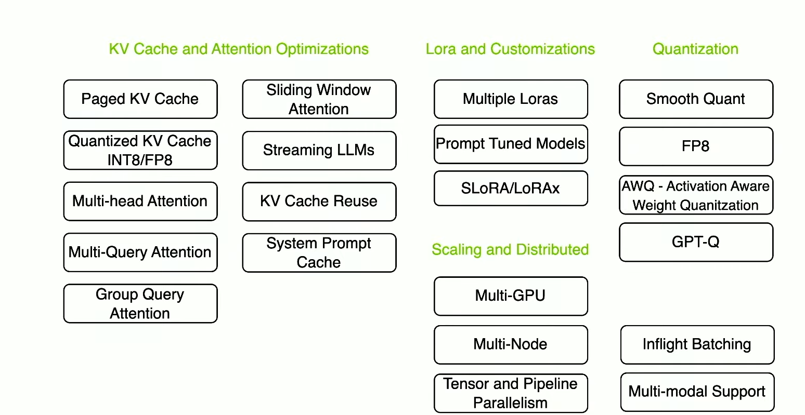

# AI System Design

## Systems
- [JIT](https://www.youtube.com/watch?v=d7KHAVaX_Rs)
- [JIT - 2](https://www.youtube.com/watch?v=KVvGVPc7QM8)
- [multiple programming languages?](https://www.youtube.com/watch?v=XJC5WB2Bwrc)

## Inference speedup
- [LLM inference optimization](https://www.youtube.com/watch?v=9tvJ_GYJA-o)  
    - KV Cache
    - Metrics
    - Prompt patterns

- [Inference optimization](https://developer.nvidia.com/blog/mastering-llm-techniques-inference-optimization/)
- [Flash attention](https://www.youtube.com/watch?v=gBMO1JZav44)
    - safe softmax
    - tiling
    - online softmax
- TensorRT
- Triton
- Quantization

Todo

## Reasoning

